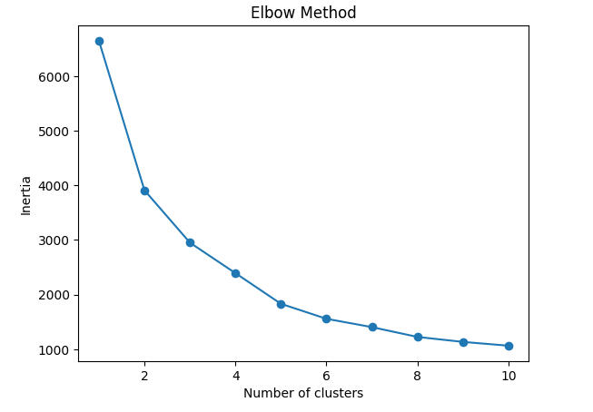

# Customer-Data-Analysis-KMeans
Customer segmentation project using K-Means clustering to analyze customer behavior based on age, income, and spending patterns.

# Customer Segmentation Using K-Means Clustering

## 🌐 Live Project
[Click here to view project](https://anju3436.github.io/Customer-Data-Analysis-KMeans/)

## 📌 Project Overview
This project focuses on customer segmentation using Machine Learning techniques. The goal is to group customers based on their behavior such as income, age, and spending habits.

## 🎯 Objectives
- Segment customers into different groups
- Identify customer behavior patterns
- Help businesses improve marketing strategies

## Elbow Method 

## 🛠️ Tools & Technologies
- Python
- Pandas
- NumPy
- Matplotlib
- Seaborn
- Scikit-learn

## 📂 Dataset
The dataset contains customer information such as:
- Age
- Income
- Spending habits
- Purchase history

## ⚙️ Steps Performed
1. Data Collection
2. Data Cleaning (handling missing values)
3. Feature Selection (Age, Income, Total Spending)
4. Data Scaling using StandardScaler
5. Finding optimal clusters using Elbow Method
6. Applying K-Means Clustering
7. Visualization of clusters

## 📊 Key Insights
- Customers are divided into different segments based on spending behavior
- High-income high-spending customers are premium targets
- Low-income low-spending customers need different marketing strategies

## 📈 Visualization
- Elbow Method graph to determine optimal clusters
- Cluster visualization using scatter plots

## 🚀 Conclusion
K-Means clustering helps businesses understand customer groups and make data-driven decisions for better marketing and sales strategies.

## 👩‍💻 Author
Anju S Santhosh 
